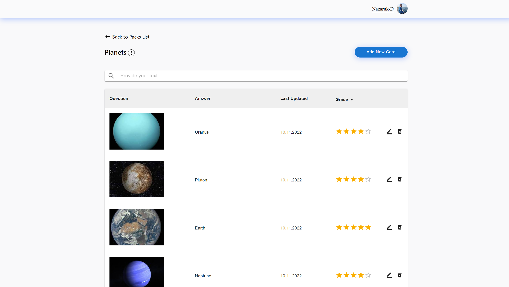
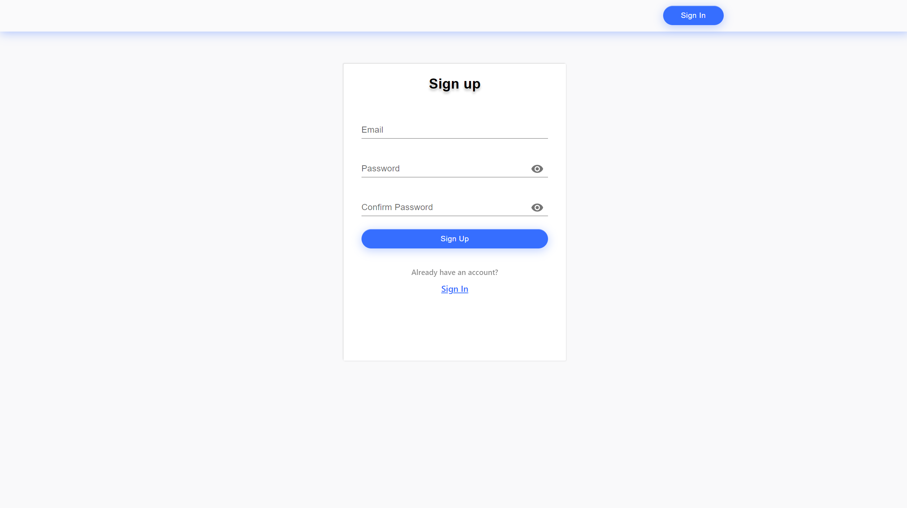

# Education cards

---

## Description

The essence of the project is that the user can choose a pack on a specific topic or create it on their own and start learning. 
The user launches a training program in which he independently answers the question.  
After that, he can look at the answer and set the grade to this question.  
Depending on the value set by the user, the frequency of hitting this question in the future depends.  
Team project. The team worked according to the template - <a href="https://www.figma.com/file/C1HxtTFYhUh57G3z18rn5v/%D0%9E%D0%B1%D1%83%D1%87%D0%B5%D0%BD%D0%B8%D0%B5-%D0%BF%D0%BE-%D0%BA%D0%B0%D1%80%D1%82%D0%BE%D1%87%D0%BA%D0%B0%D0%BC?node-id=34242%3A6&t=ygaU0bzMjH8eRyaU-0">figma</a>  
About the team: <a href="https://github.com/Nazaruk-D">Dmitry Nazaruk</a>, <a href="https://github.com/irinrudko">Iryna Rudzko</a>, <a href="https://github.com/Bmwbyas">Askerko Alexandr</a>. 
To create tasks we've used Jira, got git to collaborate, and had daily scrum meetings to communicate and catch up with the team. 

Application functionality:  

-   Loginization / registration  
-   Password recovery  
-   Adding / edit / removal a pack  
-   Adding / edit / removal a card  
-   Grading each card  
-   Searching / filtering packs and cards  
-   Adding a pack cover  
-   Image instead of text question  

---

### :briefcase: language and tools

 
 

[//]: # '___'

## Loginization / Registration

To register, just enter your email and a new password (must consist of at least 8 characters)  
If your email is not in the database, a new account will be registered. 
Next, go to Login and enter your login details. 

The following libraries are installed in this project:

-   **material-ui**

-   **axios**

-   **formik**

-   **gh-pages**

-   **jest**

-   **react** and **@types/react**

-   **react-dom** and **@types/react-dom**

-   **react-redux** and **@types/react-redux**

-   **react-router-dom** and **@types/react-router-dom**

-   **react-scripts**

-   **redux**

-   **redux-thunk**

-   **reselect**

-   **typescript**

-   **uuid** and **@types/uuid**

-   **sass**

-   **prettier**

## How to start a project

After git clone 'link' install all dependencies from package.json:

### `yarn`

and then run the project:

### `yarn start`
